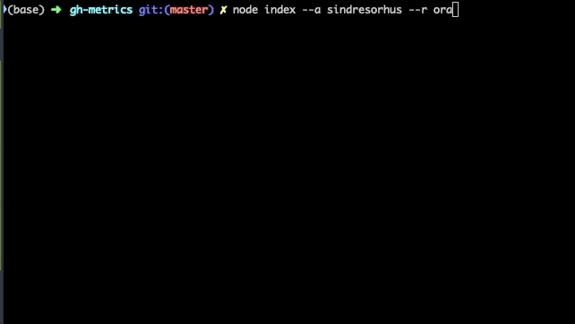

# gh-metrics

> A command line tool that calculates pull-request and issue metrics given a GitHub repository

## Usage

[Create a personal GitHub token](https://help.github.com/en/github/authenticating-to-github/creating-a-personal-access-token-for-the-command-line#creating-a-token) with the scopes **repo**.

Run the tool using `npx`:

`GITHUB_TOKEN=<yout-token> npx @figify/gh-metrics --a <account org or user> --r <repository name>`

or straight:

`npx @figify/gh-metrics --a <account org or user> --r <repository name>`

if you have a `GITHUB_TOKEN` environment variable already set.

Example for a dependency used:

`GITHUB_TOKEN=<yout-token> npx @figify/gh-metrics --a sindresorhus --r ora`

## Metrics

The following metrics are calculated:

- Average Time to Close (in days, does not account for issues closed and re-opened)
- Average Comments per Issue
- Average Time to Merge (in days)
- Average Comments per PR (Open, Closed or Merged)
- Average Comments per PR (Closed or Merged)
- Average Reviews per PR (Closed or Merged)
- Average Interactions (comments, reviews, review comments) per PR (Closed or Merged)

## Maintainer

[Kyriakos Chatzidimitriou](http://kyrcha.info)

## Roadmap

- Add GitHub Actions
- Add some testing
- Publish both to npm and GitHub registries
- Do the calculations in memory instead of storing in memory everything
- Store in csv/json files option
- Option to calculate only issues or only PR metrics
- Create a mini-site

## Contributing

TODO

## Publishing guide

Example because I forget:

- `git tag -a v0.1.0 -m "Version 0.1.0 - First working version"`
- `git push origin v0.1.0`
-  `npm publish --access public --dry-run`

## License

[MIT](LICENSE)
